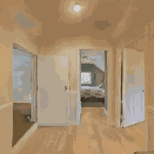
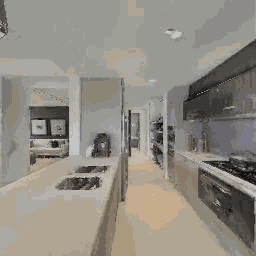
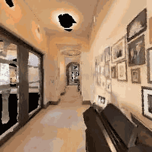

# 🧭 GoViG: Goal-Conditioned Visual Navigation Instruction Generation
[]() 


* 🚀 [Project Web Page](Coming soon)
* 📂 [Dataset](Coming soon)


GoViG introduces a new task in embodied AI: generating navigation instructions directly from egocentric visual observations of the initial and goal states. Unlike previous methods that rely on semantic maps or structured annotations, GoViG operates purely on egocentric visual input—making it highly adaptable to unseen and unstructured environments.

## 🔍 Overview

GoViG decomposes the instruction generation task into two interconnected subtasks:

- **Navigation Visualization**  
  Predicts intermediate visual states that bridge the initial and goal views.

- **Instruction Generation with Visual Cues**  
  Synthesizes linguistically coherent and spatially grounded instructions based on both observed and anticipated visuals.

These components are unified within an autoregressive MLLM, trained with tailored objectives to ensure spatial accuracy and linguistic clarity.

## 🧠 Reasoning Strategies

Inspired by human navigation behavior, GoViG supports two multimodal reasoning paradigms:

- **One-Pass Reasoning**: Generates instructions in a single forward pass.
- **Interleaved Reasoning**: Alternates between visual prediction and language generation for incremental planning.

## 📦 Dataset: R2R-Goal

To evaluate GoViG, we introduce **R2R-Goal**, a dataset combining synthetic and real-world trajectories.


## Quick Start

```bash
conda create -n GoViG python=3.10
conda activate GoViG
pip install torch==2.4.0
pip install -r requirements.txt --user
```

## Implementation

### Data

We now release a partial dataset for the purpose of debugging and demonstrating the data format. You can find them in [data_samples](data_samples/)

### Training

```bash
bash train.sh
```

### Evaluation

```bash
bash eval.sh
```

you can find detailed metrics calculation in [taskeval_vis.py](taskeval_vis.py).


# 🧭 GoViG Gallery


| Initial View | Goal View | Predicted Trajectory (Onepass) | Generated Instructions | Predicted Trajectory (Interleaved) | Generated Instructions |
|--------------|-----------|-----------------------------|------------------------|-----------------------------|------------------------------------------------|
|  |  |  | Stop in the doorway.|  | Stop in front of the last door on your right.<br>Then take a slight left turn to go towards the bathroom.<br>After you leave the kitchen and go through the double doors, keep going and go into the living room.<br>Turn left at the first door past the oven and continue down the hallway.<br>Go into the powder room that is straight ahead.<br>Walk past the bathroom door.|
|  |  |  | Walk into the bedroom.|  | Walk out of the bedroom using the door on your right.<br>Walk out of bedroom and turn right.<br>Leave the bedroom.<br>Turn to your right and go outside.<br>Exit the room.<br>Exit bedroom through doorway on the right.|
|  |  |  | Across the kitchen.|  | Exit the kitchen.<br>Turn right at the counter.<br>Walk past kitchen island.<br>Turn past the sink, and in front of the oven to your left.<br>Make a left immediately through the kitchenette, then turn right into the hallway.<br>Walk past the sink.|
|  |  |  | Go through the door.|  | Straight through the bedroom with the lamp.<br>Turn left and wait in the doorway.<br>Stop in the bedroom doorway.<br>Then turn right and wait in bedroom at the end of the hall.<br>Stop in the doorway.<br>Turn slight left, continue straight. Turn slight left, stop at bed.|
|  |  |  |Walk out of the kitchen.|  | Walk through the kitchen stop at the oven.<br>Continue walking straight down the kitchen.<br>Turn left, walk down the kitchen hallway.<br>Turn left and enter kitchen.<br>Walk and stop right before washing area.<br>Turn right and continue down the hall until you get to a refrigerator.|
|  |  |  |Walk past the room on the left.|  |Walk past the door directly across from you.<br>Continue straight and continue through a second set of double doors.<br>Pass the wall on the right.<br>Turn left and enter kitchen.<br>Go down the hall into the office on the left.<br>Walk to the end of the hall and through the open door.|
|  |  |  |Walk up stairs, turn right, continue up stairs|  |Walk up stairs.<br>Go up the stairs.<br>Walk straight ahead passed the stairs.<br>Go up the stairs.<br>Go up three steps then wait at the top.<br>Go all of the way up the stairs.|
|  |  |  |Walk past the room on the left.|  |Stop in entryway of house.<br>Stop at sliding barn door.<br>Wait near the patio.<br>Turn to the front row of couches is showing and walk over to the patio. Wait in the doorway to the patio.<br>Walk straight besides the wooden tables.<br>Stop when you reach the sliding glass doors.|


